# Poker card recognizer with python, opencv and numphy

NOTE: This is WORK IN PROGRESS
## Context
[Rentz](https://ro.wikipedia.org/wiki/Rentz) is a [card](https://en.wikipedia.org/wiki/Standard_52-card_deck) game with 8 modules.
You might be familiar with [Whist](https://en.wikipedia.org/wiki/Whist), which is one of the 8 modules.
Calculating and tracking the points for each user can be challenging and we are trying to automate this process.

This repository is a module of a larger system, which when glued together will solve the Rentz points calculation & tracking.
What to expect from this module:
- input = an image containing at least one pocker card
- output = a list of recognized poker cards

## Why not re-using an existing github project
As mentioned above, this is NOT a proof of concept and I want to use this recognizer in a real life situation.
Which means that the recognizer must:
- work for images which contain 1 card
- work for images which contain n cards
- the cards can be rotated
- the cards can overlap eachother
- no constraints regarding the image/card dimensions
- no constraints regarding how far the videocamera should be placed from the image
- easily adapt to a new deck of cards
- accuracy is important; otherwise I can calculate the points by myself without losing time with taking pictures

## Ubiquitous language
Let's make sure that we are referring to the same things.

1. "processed image" or "pre processed image" = The black and white version of the image.

2. "image" or "original image" or "not processed image" = The image you are feeding to the recognizer. Not "pre-processed" in any way.

3. "mask" or "template" = An image containing the top-left of a card (including the card rank & suit). Used for template matching.

4. "zoom" or "zoomed image" = (Bad naming, but I'll stick with it.) By zooming in/out an image, we refer to the process of scaling up/down the image (changing the image dimensions without losing content)

## How it (currently) works
1. Standard image transformation
    - The recognizer first loads your image:
    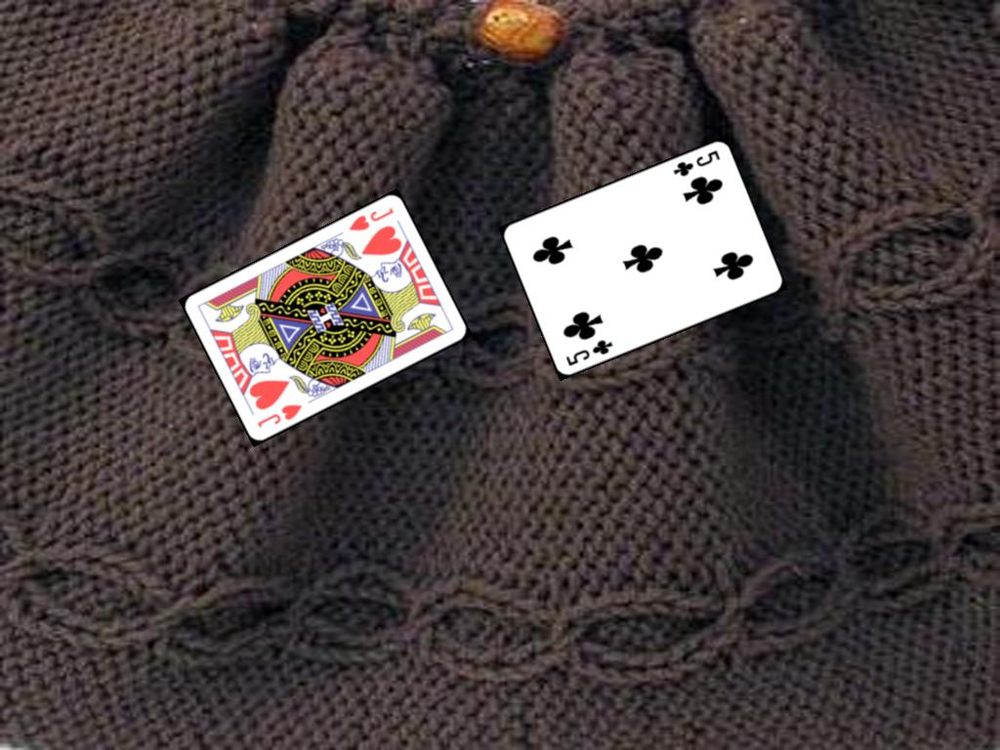

    - And applies standard transformations.

    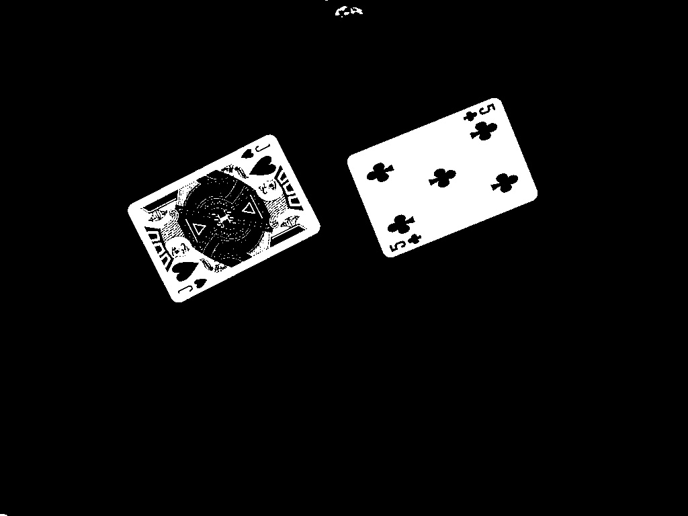
    Nothing unusual until now, you'll find this pattern in most of the image processing repos.

2. Finding the cards dimension (x, y width, height)
    - IMPORTANT: Your image must contain at least one card that is fully visible and it's not overlapping other cards. This card must be the first one (from left to right).

    - In order to extract the width of the cards, you need to:
        1. option 1 have a reference object in your original image
        2. option 2 install your camera on a fixed support (you'll need to regenerate your masks each time you move the support)
        3. option 3 use the lidar sensor to determine the depth
    
    I find the second option to be very unpractical.
    The third one is for rich people only (+ that I haven't implemented & tested this solution).
    
    The 1st option is currently implemented and it's using the "stand alone" card (check the Important section from above) to determine the dimensions.

    This step only exists because we want to support overlapping cards.
    When cards are overlapping, it's very difficult to find each card's dimension.

    - extract all cards from the processed image (the list is sorted from left to right)
   
    - take the first card

    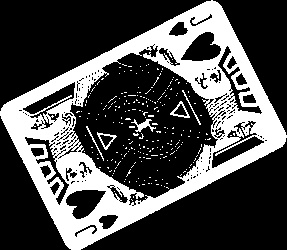
   
    - extract its contours (note: I'm using the colored image to display the contours, because I cannot draw with colors into the processed image)

    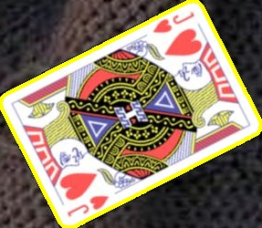
  
    - use the contours to find the required rotation angle
    ```
    rotation_angle = find_rotation_angle(contour)
    ```
    - rotate the card

    
    
    - extract the contours of the rotated card

    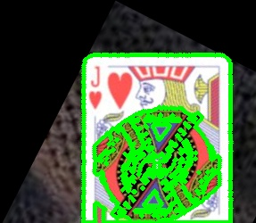


    - use the contours to find the card coordinates (x, y, width, height) and return the card's width
    ```
    find_coordinates(contours_of_possible_card_rotated)
    ```

3. Resizing the processed image
    - determine the zoom factor based on the width we got from the previous step

    Note: If you change the CARD_WIDTH, you'll need to regenerate your masks.
    I don't think you have to mess with the CARD_WIDTH, because it's only a "reference"/"pivot".


    ```
    zoom_factor = CARD_WIDTH / card_width
    ```
    - and resize the processed image

4. Extracting the possible cards (Note: from this point we are using the resized processed image)
    - the following returns a list of cards:
    ```
    extract_possible_cards(processed_image, image)
    ```
    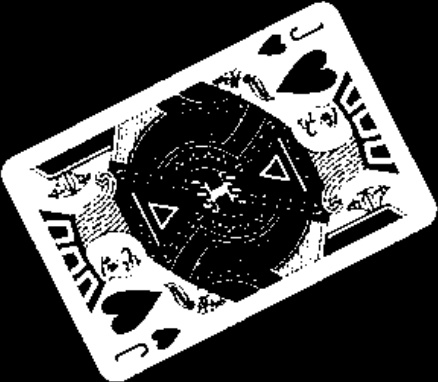
    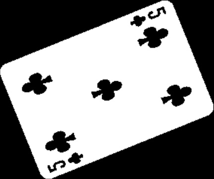

5. Rotating the possible cards
     - option 1: use contours to determine & rotate the cards
     - option 2: use lines to determine & rotate cards

    My initial implementation was using the first option, but it didn't performed very well on overlapping cards.
    The second solution is using the Probabilistic variant of Hough Transform to find the lines.
    Before detecting the lines, we have to detect the edges with the Canny function:
    ```
    edges = cv2.Canny(processed_image, 50, 150)
    ```
    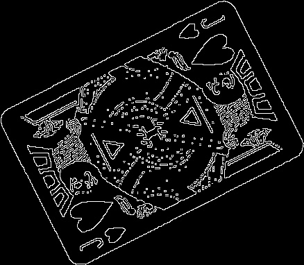
    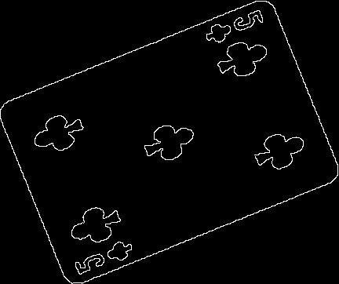

    And then pass the edges to the HoughLinesP function:
    ```
    cv2.HoughLinesP(edges, 1, np.pi / 180, threshold=50, minLineLength=100, maxLineGap=20)
    ```
    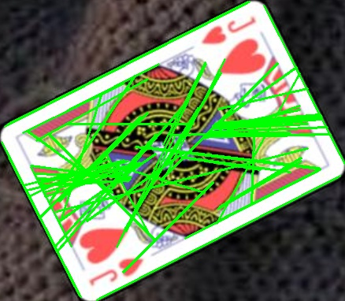
    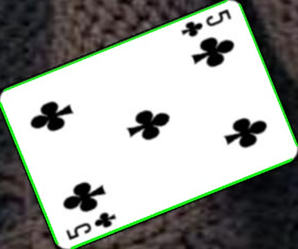

    - Now that we have the lines, let's see if we can find those lines that make a 90 degree angle.
    Two perpendicular lines mean that at their interesection it's possible to find a card corner.
    ```
    tuple_of_lines_that_intersect_at_90, tuple_of_angles_of_lines_that_intersect = find_lines_that_intersect_at_90(lines)
    ```
    - At this point we have a list of perpendicular lines and their rotation angle.
    The rotation angle represents how many degrees we should rotate the line, in order to make it perpendicular with X axis.
    This generates a bunch of variations, but we are expecting that some of the generations to have the cards in their desired position:

    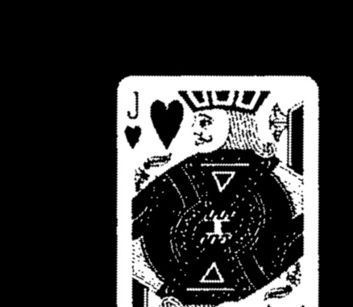

    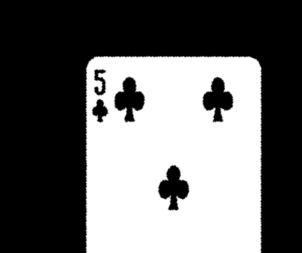

6. Extracting the card headers
    - the card rank and suite is located in the card header top-left corner
    - take all the rotated images and crop the header
    - this step is optional, but should make the matching faster

7. Recognizing the cards ranks and suites
    - this will try to match all the masks against all card headers
    - the underlying function is using the matchTemplate provided by opencv
    ```
    # I believe this is a copy paste from opencv docs
    # You can change the method if you want, but I've noticed the best accuracy with TM_CCOEFF_NORMED
    def match_against_mask(image, mask):
        method = cv2.TM_CCOEFF_NORMED

        h, w = mask.shape[:2]

        img = np.copy(image)
        res = cv2.matchTemplate(img ,mask, method)
        min_val, max_val, min_loc, max_loc = cv2.minMaxLoc(res)
        
        # If the method is TM_SQDIFF or TM_SQDIFF_NORMED, take minimum
        if method in [cv2.TM_SQDIFF, cv2.TM_SQDIFF_NORMED]:
            top_left = min_loc
        else:
            top_left = max_loc
        bottom_right = (top_left[0] + w, top_left[1] + h)
        bottom_right = (top_left[0] + w, top_left[1] + h)      
        return top_left, bottom_right, max_val
    ```

## Pre requisites
We have the following imports:
cv2 (opencv),
numpy.

You can download this dependencies with [conda](https://www.anaconda.com/download).
Tip: you should first create a new conda environment; using the default one might not work as expected.

I recommend asking chatgpt about how to install opencv and numpy (conda install opencv won't do the trick) and I don't remember the exact installation process.

```
conda list opencv
```


| Name      | Version | Build           | Channel      |
|-----------|---------|-----------------|--------------|
| libopencv | 4.9.0   | py39h8b10f08_8  | conda-forge  |
| opencv    | 4.9.0   | py39h5414f36_8  | conda-forge  |
| py-opencv | 4.9.0   | py39h610bada_8  | conda-forge  |


```
conda list python
```


| Name       | Version | Build            | Channel      |
|------------|---------|------------------|--------------|
| python     | 3.9.18  | hd7ebdb9_1_cpython | conda-forge |
| python_abi | 3.9     | 4_cp39           | conda-forge |

## Directories

### ./cards
Images from the Cards directory have the following properties:
- each image contain exactly 1 card
- the image name is the card classifier

    e.g. if your image contains the 9 of club, the file should be named 9c.jpg (or whatever extension you are using)

    e.g. if your image contains the 10 of spade, the file should be named 0s.jpg (notice that the 10 is mapped as 0)

    e.g. if your image contains the Ace of diamond, the file should be named Ad.jpg (notice that the 10 is mapped as 0)

    etc
This directory is not used during the recognition phase.
The files are only used by masks.py to extract the masks into ./masks.

This directory is populated with card images fetched from this Wikipedia[https://en.wikipedia.org/wiki/Standard_52-card_deck] page.

### ./generated
I'm using this for debugging purposes.
When running the recognize.py, it will first remove the files from ./generated.
At some point during the run, ./generated will be populated with parts from your input image.
I'm referring to this generated images as possible cards ("possible" because ~75% is crap and the rest should have the actual image that I need)

This files help me to see what I'm feeding to cv2.matchTemplate.

### ./masks
This directory is very similar with ./cards.
The difference is that the images are not containing the whole card, but only the top-left corner (where the card rank and the card suit).

The files from ./masks ARE using during the recognition phase.

### ./test
Contains playground files.

## Running the recognizer

python ./recognizer.py

## Setting up the detector for a custom card deck
The recognizer will work only if the masks are cropped from the same deck.
1. In case you want to add your own deck, than you will have to:
- take a picture of each card from the deck (the ideal photo looks like the ones from ./cards)
- make sure your pictures names are following de [card_rank][card_suite].[file_extension] convention (e.g. 2c.jpg)
- move your pictures under ./cards directory (override existing ones)
- run the ./masks.py script
Expected:
- ./masks directory should be populated the extracted masks

2. Change ./recognize.py to point to your image that contains cards
Expected:
- the cards classifiers with their confidence score to be printed
